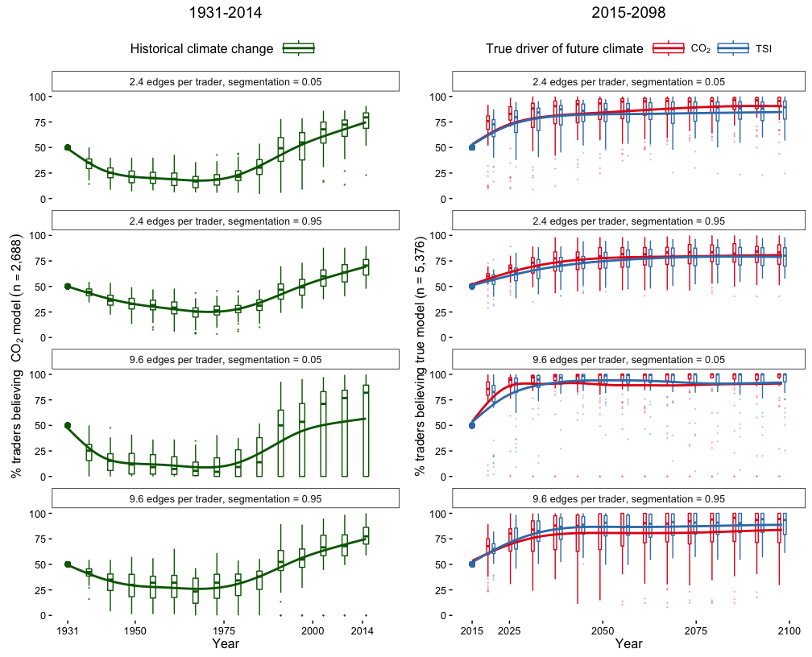

<!-- README.md is generated from README.Rmd. Please edit that file -->
Betting and Belief: Prediction Markets and Attribution of Climate Change
========================================================================

[John J. Nay](http://johnjnay.com/) (School of Engineering, Vanderbilt University), [Martin Van der Linden](https://martinvdlinden.wordpress.com/) (Economics, Vanderbilt University), and [Jonathan M. Gilligan](https://my.vanderbilt.edu/jonathangilligan/) (Earth and Environmental Sciences, Vanderbilt University).

Despite much scientific evidence, a large fraction of the American public doubts that greenhouse gases are causing global warming. We present a simulation model as a computational test-bed for climate prediction markets. Traders adapt their beliefs about future temperatures based on the profits of other traders in their social network. We simulate two alternative climate futures, in which global temperatures are primarily driven either by carbon dioxide or by solar irradiance. These represent, respectively, the scientific consensus and a hypothesis advanced by prominent skeptics. We conduct sensitivity analyses to determine how a variety of factors describing both the market and the physical climate may affect traders' beliefs about the cause of global climate change. Market participation causes most traders to converge quickly toward believing the "true" climate model, suggesting that a climate market could be useful for building public consensus.

This repository contains all the code and data for this simulation model.

Under most parameterizations, within 15-20 years, the median fraction of traders believing in the true model is over 75%:

<!-- -->
